# Image Based Sales Captioning

## Overview
This repository contains a image captioning/description net that can be used to automatically create simple descriptions for furniture.

If you are just here to read a notebook on how to build a image captioning net in Keras 2 and TensorFlow, you can follow through the notebook [here!](#notebook-that-doesn't exist yet)

## Motivation

Many large companies are exploring Augmented Reality ‘AR’ as it becomes mainstream. Walmart in particular is considering using this technology to enhance their home furnishings business. One goal is to take a photo from a room in a customer’s house and use AR to make recommendations for furniture they should add or swap out. Below is an example of the goal of this project.

### Example
<table>
  <tr>
    <th>Image</th>
    <th>Caption</th>
    <th>Image</th>
    <th>Caption</th>
  </tr>
  <tr>
    <td></td>
    <td>Wood Metal Coffee Table</td>
    <td></td>
    <td>Black Modern Sectional Sofa</td>
  </tr>

</table>

## Table of Contents
1. [Overview of Nets Used](#overview-of-nets-used)
2. [Methodology](#methodology)
    * [Scraping](#scraping)
    * [Sample Data](#sample-data)
    * [Processing](#processing)
    * [Net Architecture](#net-architecture)
3. [Results](#results)
4. [Criticisms of the Model](#evaluations-and-criticizing-the-model)
5. [Core ML](#core-ml)
6. [Next Steps](#next-steps)
7. [Tech Stack](#tech-stack)
8. [References](#references)

## Overview of Nets Used
### VGG16
VGG116 is a convolutional neural net designed by and trained by the Visual Geometry Group of Oxford [(1)](#references). It has become popularized and used as the basis for many image based nets. VGG16 uses smaller filters in a deeper fashion. This allows for better handling of non-linear features, which tend to be important in images when looking for patterns. Within this repository a VGG16 net that has been pretrained on ImageNet data is used. I truncated the net early and as result was able to use the output from one of the final dense layers as the input to my net. The summary output of the net used can be found [here.](images/vgg_architecture.png)

### RNN's
Long short term memory (LTSM's) are a specific flavor of recurrent neural nets (RNN). Recurrent neural nets have an amazing ability to handle sequences, and thus generate time based predictions. For example in generating a description it is helpful to know what words come before. Certain objects may only be described by specific words. In addition, RNN's and LSTM's are commonly used as alternatives to traditional ARIMA time series analysis. Any data that contains some sort of sequence in theory can be analyzed using an RNN, people in the past have used RNN's to generate. A traditional RNN has a node for each element in the sequence, and data is passed from node to node traditionally with a ReLu or tanh activation function [(2)](#references).

#### LSTM's
LSTM's are based on the same architecture as an RNN but they also have additional weights that determine how long to store an item in memory. This allows them to have a longer memory. These weights are calculated internally and determined by training. To give you an example of how these nets learn, I bet you can finish the following sentence:

`The first rule about Fight Club is you do not talk about ______.`

#### Bidirectional LSTM's
Bidirectional LSTM's are very similar to LSTM's but they are designed such that not only does the prior words in a sequence matter but so do the future words. It does this by reversing the sequence and running a traditional LSTM on it. This can be thought of in terms of sequences and context, as humans also learn in this way.  

If I give just the first portion of a text it is difficult to predict the next word:

`There's no _____`

But if I give you the last part of the sentence, certainly you can fill out the missing word(s):

`There's no _____ like home.`

Bidirectional recurrent neural nets essentially do the same thing by training both backwards and forwards through a sequence. However they would this is a both:

`There's no place like home.`

and

`home like place no There's`

Visually it looks something like this:

These nets are fantastic learners but can be computationally intensive. Other flavors of RNN's can be used bidirectionally such as GRU's and vanilla RNN's

In this model it is not strictly necessarily to use a bidirectional LSTM but it certainly provides much better results. They have also been used in neural machine translation (language to language) [(3)](#references), protein structure prediction [(4)](#references), and reconstructing gaps in time series data [(5)](#references).

## Methodology

This project took on many steps, from web scraping for the data to determining how to evaluate the results obtained. The first step was web scraping.

### Scraping

Product ID's were scraped off of Walmart's website using beautiful soup and then passed through their API in order to get image URL's, names, prices, etc. I automated this process to store the information in a mongodb database in the cloud (EC2), as I would need to access the information when processing the image for the net. An example of the results from the API call can be found [here](images/example_api_call.html), this the example from WalMart's website, the data I used was specific to furniture [(6)](#references).

### EDA and Pre-processing

Once the data was scraped I was able to actually begin analyzing the scope of my problem. After looking at the data I realized there were 93 different categories n the furniture section and furthermore the categories were not evenly distributed. This can be seen in Figure 1 (left). This would make it very difficult to do any basic classification as the model for creating descriptions. Furthermore, there is also a poor distribution of words, they were clearly correlated with the category imbalance. A histogram of the Top 500 word counts can be found in Figure 1 (right).

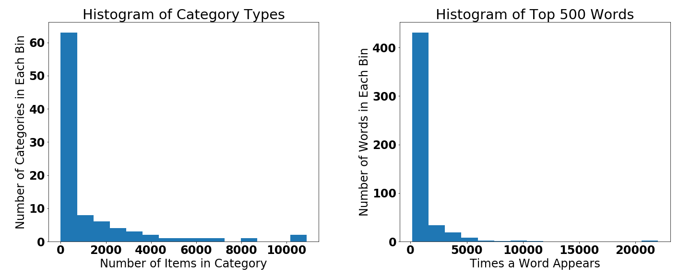

<b>Figure 1:</b> Histograms of Categories and Words of Scraped Data

Stopwords, punctuation and brand names, were removed and a word cloud was generated in order to easily determine which words and phrases were the most common (Figure 2). [(7)](#references)

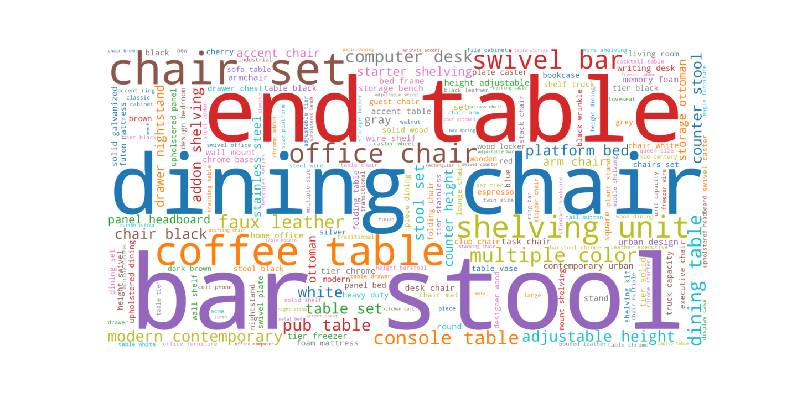

<b>Figure 2:</b> Word Cloud of Name Data Scraped from API

It's clear we have an overwhelming amount of chairs and stools. Looking forward, this suggests we may end up over fitting the net on chairs and bar stools. That will certainly be something to consider in the future.  

### Data Processing

A subset of 20k images was used and selected randomly from the database. Each image was processed through VGG16 (ImageNet weights) and encoded into a 4096 size array. These arrays were then stored for use in the net. This can be shown in red image below.

The text data was cleaned and `<start>` and `<end>` tokens were created. From here a vocabulary dictionary was created, linking words to indices and indices to words. The text was then encoded with the indices and 0's were added after to pad the length of each sequence to the length of the longest description. These arrays were then sequenced and stored for use in the LSTM. This process can be seen in the blue image below.

### Net Architecture

The stored image arrays (shown in red), go through a dense layer. Then 10% of the nodes are dropped out. From here the output is repeated 30x, 1 time for each potential word in the description. In a future iteration, I would like to move the dropout to after the repeated layer, which would cause a little bit more variance in which features are dropped in a sequence.

The stored text descriptions (blue) are passed through an LSTM and into a time distributed dense layer, which allows for sequence handling out of the LSTM.

At this point (1C). The data is concatenated together and passed through a bidirectional LSTM after which a 10% dropout is applied. From there the output is passed into a dense layer with nodes corresponding to each word in the vocabulary (5544 words). A softmax activation is applied and probabilities for each word are returned. These results are then compared to the expected description using a categorical cross-entropy loss function, and weights are back propagated using a Nesterov Adam optimizer, with default parameters. This is all shown in the figure in green. To view the Keras architecture summary click [here.](images/keras_summary.png)

### Making Predictions

There are two methods to create predictions with an LSTM. The first is an argmax search. This is done by taking the word with the highest probability and feeding it back into the LSTM to determine the next word. Once, you get the results, you take the word with the highest probability, and feed the entire sequence back into the LSTM. This continues until a stop token is encountered! The argmax method is quick and easy and generally works pretty well. This method is shown in purple.

An even better approach is to use the Beam search algorithm. The Beam search algorithm essentially uses the top 'n' predictions and generates probabilities, it then runs predictions on all 'n' of those terms and continues. At the end of the sequence, all paths are compared, and the path with highest probability is chosen. This is a very computationally intensive algorithm and is generally restricted to an 'n' of 3 or 5 and the other results are pruned. When evaluating below the Beam score with index 5 was used.

## Results

The model was built using Keras' functional API. Tensorboard was used for visualizations of weights and net graphing. Initially many models were tested, I swapped out GRU's, traditional RNN's, changed embedding sizes, changed number images used, added dense layers, cleaned data using Spacy. It was very difficult to evaluate the success of these models. I eventually settled on two ways to evaluate and criticize the model and I will discuss those shortly.

First, lets look at a traditional metric, accuracy. Figure 3 shows how the Loss and Accuracy changed over time for both a validation set and the training set. Based on the validation loss it is clear to me there is likely some overfitting on the training data, after about epoch 8. That said an accuracy of about 30% is pretty incredible when predicting from over 5544 words.

<b>Figure 3:</b> Training and Validation Loss and Accuracy 

I was still a little resistant, if accuracy is still increasing shouldn't I just keep training. I ended up writing a function to run an epoch, make predictions on hold out data, store the results, then repeat for 50 epochs. This way I could actually visually determine if the model was overfitting and the results were being skewed. This data can be found below for select images.

| Epoch | Bed with Mattress | Wire Shelving | Night Stand | Groovy Book Case | Bar Stool | Hutch |
| ----- | ----------------- | ------------- | ----------- | ---------------- | --------- | ----- |
|   N/A | 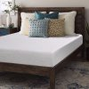||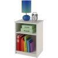||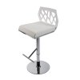|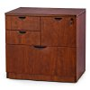
| 1| panel bed| tier addon truck|bookcase shelf|tier shelf shelf shelf|bar stool|drawer nightstand|
| 2|upholstered platform bed|tier chrome addon shelving unit|drawer nightstand|modern contemporary urban design table black|adjustable adjustable bar stool|drawer nightstand|
|3| gel memory foam mattress multiple sizes |tier chrome starter shelving unit|storage nightstand white|modern contemporary urban design wall room room room room room desk room desk stand|swivel bar stool set|drawer nightstand cherry|
|9 |piper platform bed espresso|tier chrome addon shelving unit|computer desk hutch|tier floating wall mount floating wall mount solid decor|adjustable height swivel bar stool|drawer file cabinet milled cherry|
|25|air flow queensize box spring memory foam mattress set|tier sided wire shelf truck rods|hannah drawer nightstand white|folding portable laptop table portable laptop table home office black|adjustable height swivel bar stool|drawer lateral file cabinet classic oak|
|50|continental gel memory foam mattress topper|capacity mobile unit wire shelves solid shelf|nightstand soft white|console table black|arctic contemporary black vinyl adjustable height barstool chrome base|ascent file cabinet polyvinyl chloride aluminum file drawers legal letter durable stain resistant locking|

After reviewing the data I determined that it was indeed possible that the model made the best predictions after about 9 epochs. As a result I reran the model for nine epochs and stopped there. Some other results both impressive and not can be found below.

### The Good

| Example 1 | Example 2 | Example 3 | Example 4 | Example 5 |
|-----------|-----------|-----------|-----------|-----------|
||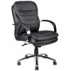|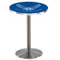|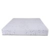|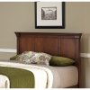
| shelf bookcase antiqued oak |black leather executive office chair brown|pub table|gel memory foam mattress multiple sizes|modern contemporary urban design bedroom king size platform bed frame white fabric wood|

### The Bad

| Example 1 | Example 2 | Example 3 | Example 4 | Example 5 |
|-----------|-----------|-----------|-----------|-----------|
|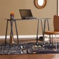||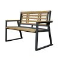| |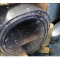
|heavy duty coffee table multiple colors|costway coffee table white|lancashire coffee table|computer desk keyboard|nba office chair brown
### The Interesting
| Example 1 | Example 2 | Example 3 | Example 4 | Example 5 |
|-----------|-----------|-----------|-----------|-----------|
|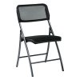|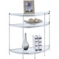||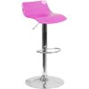|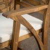
|hercules triple series triple triple braced hinged hinged padded folding guest chair set|tier plant shelf rack| adjustable computer desk keyboard black|contemporary adjustable height barstool chrome base multiple colors|abordale wood bar stool
| The repetition of words looks like the net almost didn't train long enough.| I guess I could see a plant rack, although I certainly wouldn't call it that.| This one was really specific, although the fact it included keyboard was interesting to me.|I'm really impressed that this one got the chrome base.| Close up, not perfect but certainly took me a second to identify what it is.

## Evaluations and Criticizing the Model

This is an inherently difficult task to evaluate. Certainly accuracy is a poor metric to judge this task. I attempted to evaluate variations of these models in two fashions.

First, I took each predicted descriptions and real description and lemmatized them using an NLP engine, Spacy. Then I vectorized them and used cosine similarity to gauge how similar the strings were. This model seemed to work pretty well but it also has it's problems. The real description for an image might be black computer chair, the predicted description might be mesh adjustable office chair. Although both descriptions are correct they have different words as a result they might have high cosine similarity scores. Still, this method seemed to perform pretty well.

Second, I created a simple human evaluation scoring system. I would visually look at the image and predictions and rate on a scale of 1 to 5 whether the prediction was a great fit. An excellent match was a 5, a 'okay I can see that' was a 3, and a miss was a 0. I would test 40 images and average their scores. Although it wasn't a perfect match my scores were correlated with the cosine similarity scores. Thus I used a mixture of both methods to evaluate and iterate through my models, unfortunately I was not able to find a perfect substitute for human evaluation.

Based on the results I've seen I have generally been really pleased with the models. As expected the model works incredibly well on chairs and stools, even close up examples. The model seems to fail on more abstract objects or objects at bizarre angles. In pictures with multiple objects, the model does not necessarily predict the main object, it might predict a set or another object in the room. As a proof of concept, I am incredibly pleased with the results of this model.

## Other Applications

This technology has lots of applications:
* This model could be used as the beginning to an image searching algorithm
  * Instead of searching an image by its label, you can actually search by whats in it
  * You could use whats in an image to make recommendations for similar objects or recommended objects based on a recommendation engine
* You can use this to help classify images when there are perhaps too many categories to predict traditionally
* A similar technology could be used to write descriptions for videos or audio, which would certainly help searching for those as well.
* This could be applied to frame by frame video screening, where an algorithm would alert someone when it recognized a certain pattern or description in the frames. You could chain on another LSTM to actually analyze sequences of video frames as well.

## Next Steps
* Create a core ml or flask app
* Create search functionality that would search for similar images online
* Build a recommendation engine that recommends items not in the image that match the style
* Continue testing variations of the net
* Try different CNN configurations (VGG19, GoogLe Net, etc.)

## Tech Stack

## References
(1) Very Deep Convolutional Networks for Large-Scale Image Recognition 
K. Simonyan, A. Zisserman 
arXiv:1409.1556 [[link]](https://arxiv.org/abs/1409.1556)

(2) The Unreasonable Effectiveness of Recurrent Neural Networks
 A. Karpathy [[link]](
http://karpathy.github.io/2015/05/21/rnn-effectiveness/ )

(3) Translation Modeling with Bidirectional Recurrent Neural Networks
 
M. Sundermeyer, T. Alkhouli [[link]](http://emnlp2014.org/papers/pdf/EMNLP2014003.pdf)

(4) Protein Secondary Structure Prediction with Long Short Term Memory
Networks
  S. Sønderby, O. Winther
[[link]](https://pdfs.semanticscholar.org/0431/b1ba9c4e61619404682cb929588b7efc44be.pdf)

(5) Bidirectional Recurrent Neural Networks as Generative Models - Reconstructing Gaps in Time Series
  M. Berglund, T. Raiko
 arXiv:1504.01575 [[link]](https://arxiv.org/abs/1504.01575)

(6) https://developer.walmartlabs.com/docs

(7) https://github.com/amueller/word_cloud
